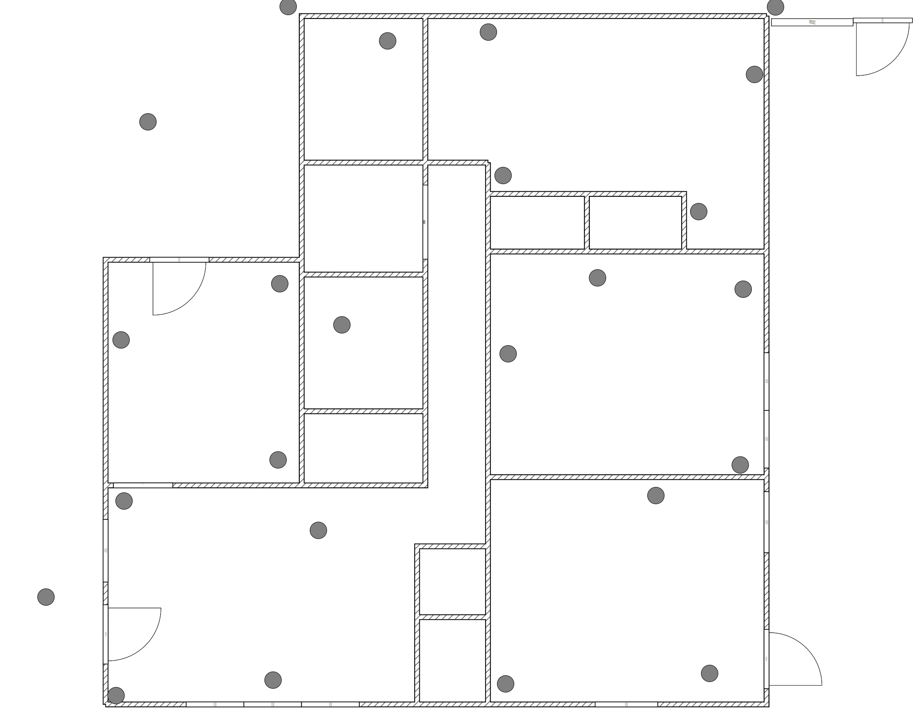
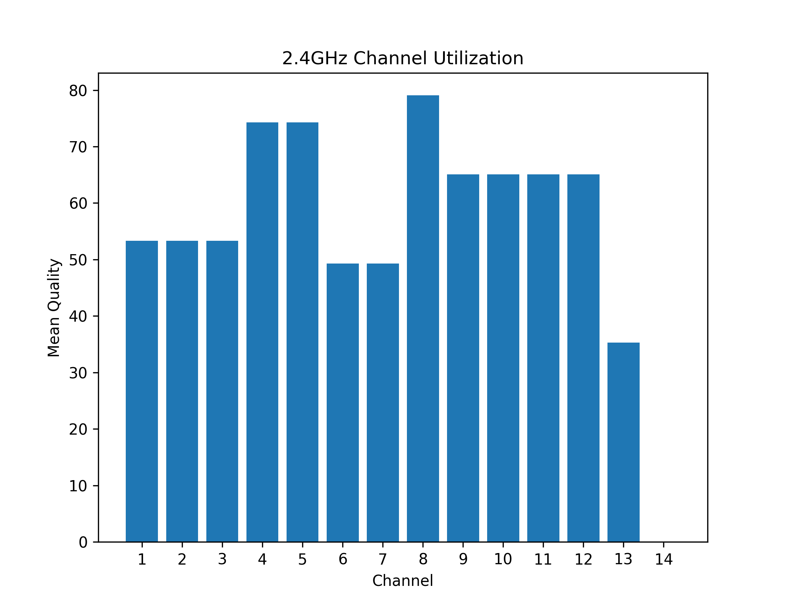
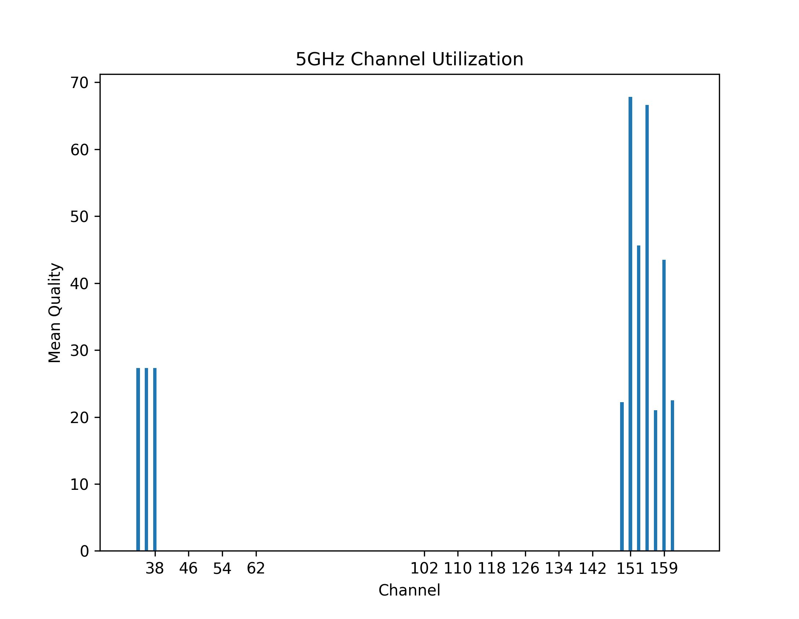
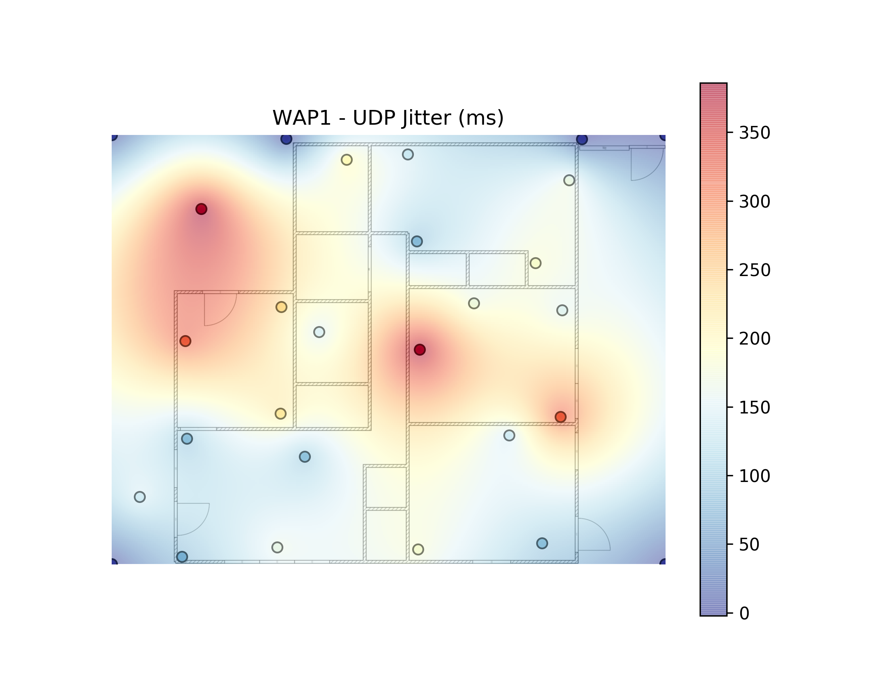
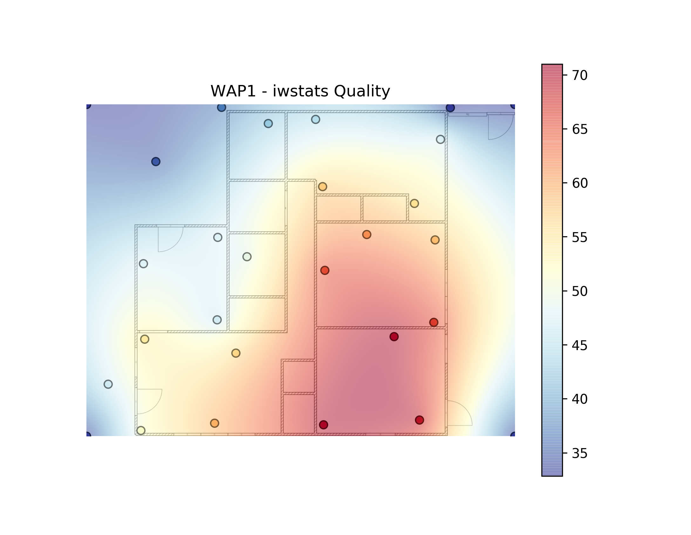
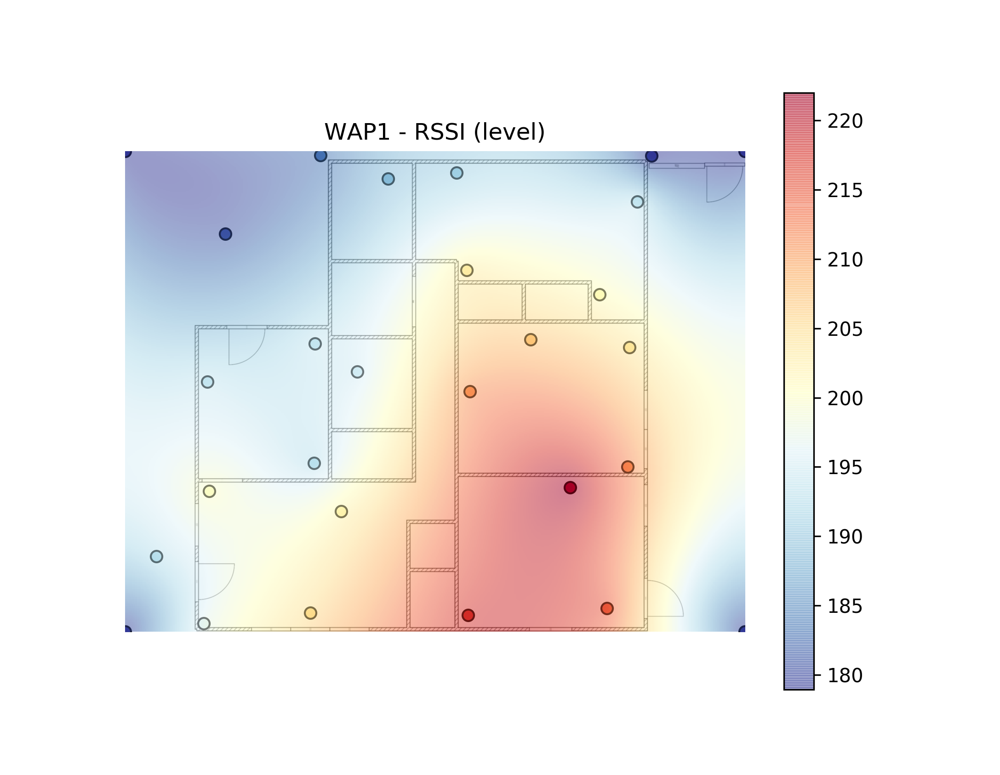
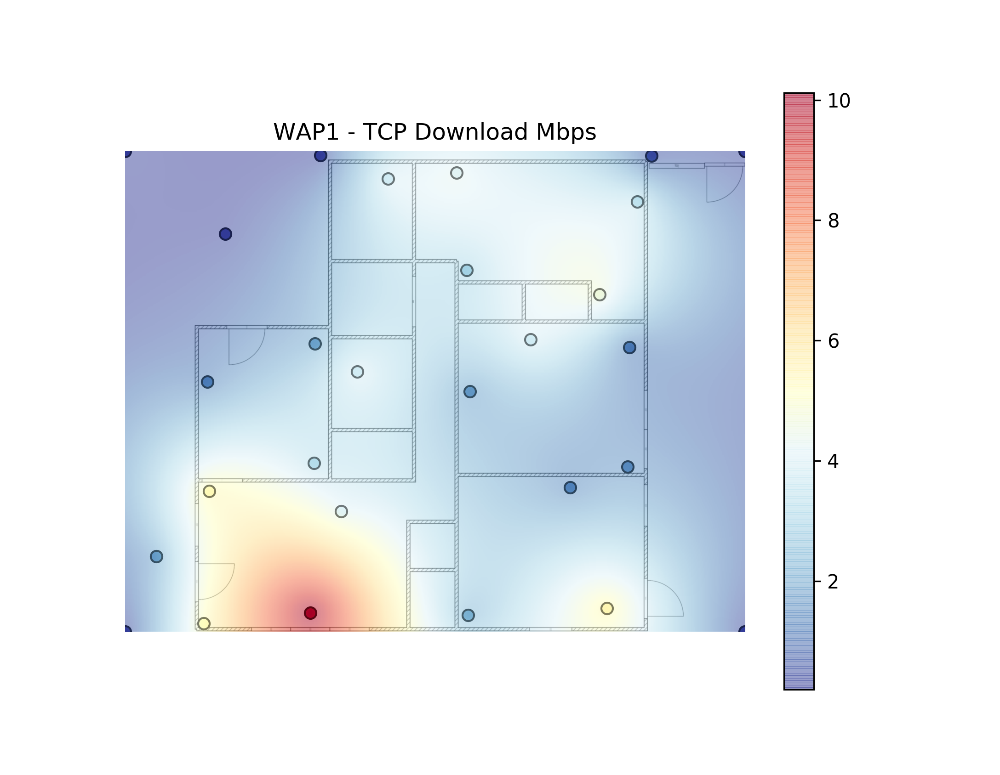
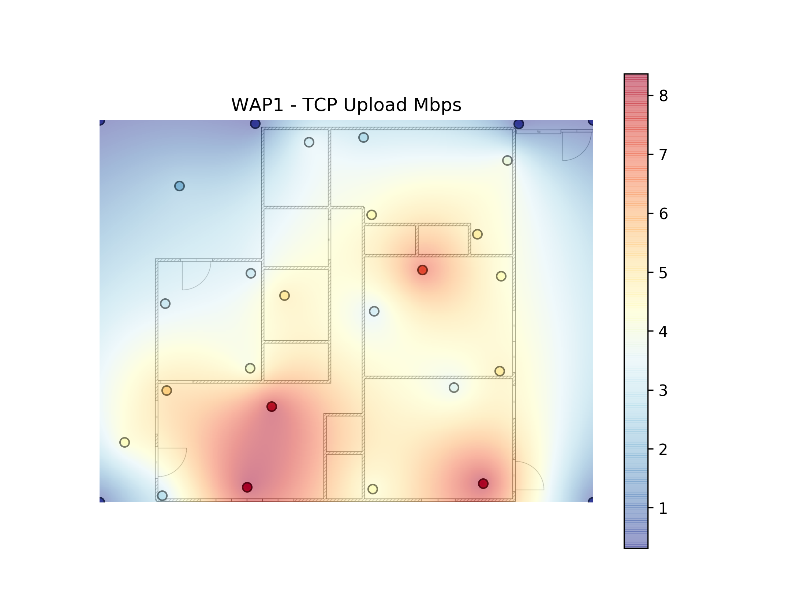
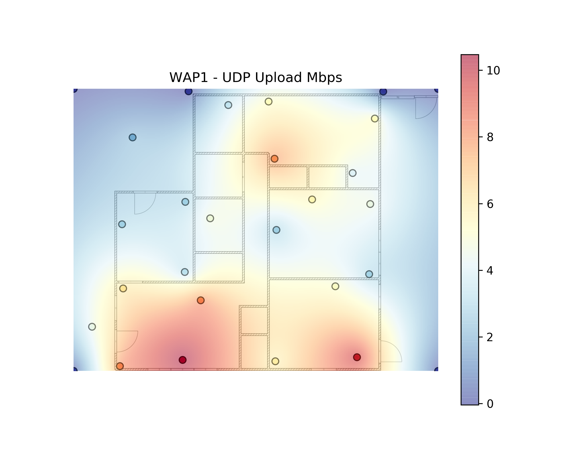

python-wifi-survey-heatmap
==========================

.. image:: https://www.repostatus.org/badges/latest/wip.svg
   :alt: Project Status: WIP – Initial development is in progress, but there has not yet been a stable, usable release suitable for the public.
   :target: https://www.repostatus.org/#wip

.. image:: https://img.shields.io/docker/cloud/build/jantman/python-wifi-survey-heatmap.svg
   :alt: Docker Hub Build Status
   :target: https://hub.docker.com/r/jantman/python-wifi-survey-heatmap

A Python application for Linux machines to perform WiFi site surveys and present
the results as a heatmap overlayed on a floorplan.

This is very rough, very alpha code. The heatmap generation code is roughly based on
`Beau Gunderson's MIT-licensed wifi-heatmap code <https://github.com/beaugunderson/wifi-heatmap>`_.

Quick start
-----------

Check out the **Running In Docker** steps below to get single-line commands that run without the need to install *anything* on your computer (thanks to using `docker`).
Creating a heatmap using the software consists of the following three essential steps:
1. Start an `iperf3` server on any machine in your local network. This server is used for bandwidth measurements to be independent of your Internet connection.
2. Use the `wifi-survey` tool to record a measurement. You can load a floorplan and click on your current location ot record signal strength and determine the achievable bandwidth.
3. Once done with all the measurements, use the `wifi-heatmap` tool to compute a high-resolution heatmap from your recorded data. In case your data turns out to be too coarse, you can always go back to step 2 and delete or move old and also add new measurements at any time.

Installation and Dependencies
-----------------------------

**NOTE: These can all be ignored when using Docker. See below.**

* The Python `iwlib <https://pypi.org/project/iwlib/>`_ package, which needs cffi and the Linux ``wireless_tools`` package.
* The Python `iperf3 <https://pypi.org/project/iperf3/>`_ package, which needs `iperf3 <http://software.es.net/iperf/>`_ installed on your system.
* `wxPython Phoenix <https://wiki.wxpython.org/How%20to%20install%20wxPython>`_, which unfortunately must be installed using OS packages or built from source.
* An iperf3 server running on another system on the LAN, as described below.

Recommended installation is via ``python setup.py develop`` in a virtualenv setup with ``--system-site-packages`` (for the above dependencies).

Tested with Python 3.7.

Data Collection
---------------

At each survey location, data collection should take 45-60 seconds. The data collected is currently:

* 10-second iperf3 measurement, TCP, client (this app) sending to server, default iperf3 options
* 10-second iperf3 measurement, TCP, server sending to client, default iperf3 options
* 10-second iperf3 measurement, UDP, client (this app) sending to server, default iperf3 options
* Recording of advertised channel bandwidth, bitrate and signal strength
* ``iwlist`` scan of all visible access points

Hints:
- The duration of the bandwidth measurement can be changed using the `--duration` argument of `wifi-survey`. This has great influence on the actual length of the individual data collections.
- Scanning for other network takes rather long. As this isn't required in most cases, you can skip this using `wifi-survey --no-scan`

Usage
-----

Server Setup
++++++++++++

On the system you're using as the ``iperf3`` server, run ``iperf3 -s`` to start iperf3 in server mode in the foreground.
By default it will use TCP and UDP ports 5201 for communication, and these must be open in your firewall (at least from the client machine).
Ideally, you should be running the same exact iperf3 version on both machines.

Performing a Survey
+++++++++++++++++++

The survey tool (``wifi-survey``) must be run as root or via ``sudo`` in order to use iwconfig/iwlist.

First connect to the network that you want to survey. Then, run ``sudo wifi-survey INTERFACE SERVER PNG Title`` where:

* ``INTERFACE`` is the name of your Wireless interface (e.g. ``wlp3s0``)
* ``SERVER`` is the IP address or hostname of the iperf3 server
* ``PNG`` is the path to a floorplan PNG file to use as the background for the map; see `examples/example_floorplan.png <examples/example_floorplan.png>`_ for an example. In order to compare multiple surveys it may be helpful to pre-mark your measurement points on the floorplan, like `examples/example_with_marks.png <examples/example_with_marks.png`_. The UI currently loads the PNG at exact size, so it may help to scale your PNG file to your display.
* ``Title`` is the title for the survey (such as the network name or AP location), which will also be used to name the data file and output files.

If ``Title.json`` already exists, the data from it will be pre-loaded into the application; this can be used to resume a survey.

Some other command-line options include:

* ``-S`` / ``--no-scan`` to disable running iwlist scans at the end of each measurement. This greatly speeds up survey time but loses the data used for channel utilization graphs. If you're using a modern wireless product that allows running RF scans, it makes sense to use that data instead of iw scans.
* ``-b`` / ``--bssid`` allows you to specify a single desired BSSID for your survey. This will be checked several times during of every measurement, and the measurement will be discarded if you're connected to the wrong BSSID. This can be useful as a safeguard to make sure you don't accidentally roam to a different AP.
* ``-d`` / ``--duration`` allows you to change the duration of each individual `iperf3` test run (default is 10 seconds as mentioned above)

When the UI loads, you should see your PNG file displayed. The UI is really simple:

* If you (left / primary) click on a point on the PNG, this will begin a measurement (survey point). The application should draw a yellow circle there. The status bar at the bottom of the window will show information on each test as it's performed; the full cycle typically takes a minute or a bit more. When the test is complete, the circle should turn green and the status bar will inform you that the data has been written to ``Title.json`` and it's ready for the next measurement. If ``iperf3`` encounters an error, you'll be prompted whether you want to retry or not; if you don't, whatever results iperf was able to obtain will be saved for that point.
* The output file is (re-)written after each measurement completes, so just exit the app when you're finished (or want to resume later; specifying the same Title will load the existing points and data from JSON).
* Right (secondary) clicking a point will allow you to delete it. You'll be prompted to confirm.
* Dragging (left/primary click and hold, then drag) an existing point will allow you to move it. You'll be prompted to confirm. This is handy if you accidentally click in the wrong place.

At the end of the process, you should end up with a JSON file in your current directory named after the title you provided to ``wifi-survey`` (``Title.json``) that's owned by root. Fix the permissions if you want.

**Note:** The actual survey methodology is largely up to you. In order to get accurate results, you likely want to manually handle AP associations yourself. Ideally, you lock your client to a single AP and single frequency/band for the survey.

Playing A Sound When Measurement Finishes
^^^^^^^^^^^^^^^^^^^^^^^^^^^^^^^^^^^^^^^^^

It's possible to have ``wifi-survey`` play a sound when each measurement is complete. This can be handy if you're reading or watching something in another window while waiting for the measurements.

To enable this, call ``wifi-survey`` with the ``--ding`` argument, passing it the path to an audio file to play. A short sound effect is included in this repository at ``wifi_survey_heatmap/complete.oga`` and can be used via ``--ding wifi_survey_heatmap/complete.oga``. by default, this will call ``/usr/bin/paplay`` (the PulseAudio player) passing it the ding file path as the only argument. The command used can be overridden with ``--ding-command /path/to/command`` but it must be one that accepts the path to an audio file as its only argument.

Inside Docker, however, this becomes quite a bit more difficult. Currently PulseAudio systems are supported, and this can be set up and enabled with the following steps:

1. Find your host computer's IP address on the ``docker0`` network: ``ip addr show dev docker0`` - mine (and most Linux machines) is ``172.17.0.1``
1. Find the CIDR block of your ``docker0`` network. I do this using ``ip route show dev docker0``, which gives me a CIDR of ``172.17.0.0/16``
1. Have PulseAudio listen on a TCP socket, allowing connections from your Docker network: ``pactl load-module module-native-protocol-tcp  port=34567 auth-ip-acl=172.17.0.0/16``
1. If you have iptables restricting traffic, insert a rule allowing traffic on port 34567 from Docker before your ``DROP`` rule. For example, to insert a rule at position 5 in the ``INPUT`` chain: ``iptables -I INPUT 5 -s 172.17.0.0/16 -p tcp -m multiport --dports 34567 -m comment --comment "accept PulseAudio port 34567 tcp from Docker" -j ACCEPT``
1. When running the Docker container, add ``-e "PULSE_SERVER=tcp:172.17.0.1:34567"`` to the ``docker run`` command.
1. When running ``wifi-survey``, add the ``--ding`` argument as specified above. Note that the path to the file must be inside the container; you can put an audio file in your current directory and use it via ``--ding /pwd/audioFile`` or you can use the default file built-in to the container via ``--ding /app/wifi_survey_heatmap/complete.oga``

Heatmap Generation
++++++++++++++++++

Once you've performed a survey with a given title and the results are saved in ``Title.json``, run ``wifi-heatmap PNG Title`` to generate heatmap files in the current directory. This process does not require (and shouldn't have) root/sudo and operates only on the JSON data file. For this, it will look better if you use a PNG without the measurement location marks.

You can optionally pass the path to a JSON file mapping the access point MAC addresses (BSSIDs) to friendly names via the ``-a`` / ``--ap-names`` argument. If specified, this will annotate each measurement dot on the heatmap with the name (mapping value) and frequency band of the AP that was connected when the measurement was taken. This can be useful in multi-AP roaming environments.

The end result of this process for a given survey (Title) should be some ``.png`` images in your current directory:

* `channels24_TITLE.png` - Bar graph of average signal quality of APs seen on 2.4 GHz channels, by channel. Useful for visualizing channel contention. (Based on 20 MHz channel bandwidth)
* `channels5_TITLE.png` - Bar graph of average signal quality of APs seen on 5 GHz channels, by channel. Useful for visualizing channel contention. (Based on per-channel bandwidth from 20 to 160 MHz)
* `jitter_TITLE.png` - Heatmap based on UDP jitter measurement in milliseconds.
* `rss_TITLE.png` - Heatmap based on the received signal strength.
* `tcp_download_Mbps_TITLE.png` - Heatmap of `iperf3` transfer rate, TCP, downloading from server to client.
* `tcp_upload_Mbps_TITLE.png` - Heatmap of `iperf3` transfer rate, TCP, uploading from client to server.
* `udp_upload_Mbps_TITLE.png` - Heatmap of `iperf3` transfer rate, UDP, uploading from client to server.
* `frequency_TITLE.png` - Heatmap of used frequency. May reveal zones in which Wi-Fi steering moved the device onto a different band (2.4GHz / 5 GHz co-existance).
* `channel_rx_bitrate_TITLE.png` - Heatmap of advertised channel bandwidth in RX direction (AP to client)
* `channel_tx_bitrate_TITLE.png` - Heatmap of advertised channel bandwidth in TX direction (client to AP)

If you'd like to synchronize the colors/thresholds across multiple heatmaps, such as when comparing different AP placements, you can run ``wifi-heatmap-thresholds`` passing it each of the titles / output JSON filenames. This will generate a ``thresholds.json`` file in the current directory, suitable for passing to the ``wifi-heatmap`` ``-t`` / ``--thresholds`` option.

Add `--show-points` to see the measurement points in the generated maps. Typically, they aren't important when you have a sufficiently dense grid of points so they are hidden by default.

Running In Docker
-----------------

Survey
++++++

.. code-block:: bash

   docker run \
     --net="host" \
     --privileged \
     --name survey \
     -it \
     --rm \
     -v $(pwd):/pwd \
     -w /pwd \
     -e DISPLAY=$DISPLAY \
     -v "$HOME/.Xauthority:/root/.Xauthority:ro" \
     jantman/python-wifi-survey-heatmap \
     wifi-survey INTERFACE SERVER FLOORPLAN.png TITLE

Note that running with ``--net="host"`` and ``--privileged`` is required in order to manipulate the host's wireless interface.

Heatmap
+++++++

``docker run -it --rm -v $(pwd):/pwd -w /pwd jantman/python-wifi-survey-heatmap:23429a4 wifi-heatmap floorplan.png DeckTest``

iperf3 server
+++++++++++++

Server: ``docker run -it --rm -p 5201:5201/tcp -p 5201:5201/udp jantman/python-wifi-survey-heatmap iperf3 -s``

Examples
--------

Floorplan
+++++++++

.. image:: examples/example_floorplan.png
   :alt: example floorplan image

Floorplan with Measurement Marks
++++++++++++++++++++++++++++++++

2.4 GHz Channels
++++++++++++++++

5 GHz Channels
++++++++++++++

Jitter
++++++

Quality
+++++++

RSSI / Signal Strength
++++++++++++++++++++++

TCP Download Speed (Mbps)
+++++++++++++++++++++++++

TCP Upload Speed (Mbps)
+++++++++++++++++++++++

UDP Upload Speed (Mbps)
+++++++++++++++++++++++

